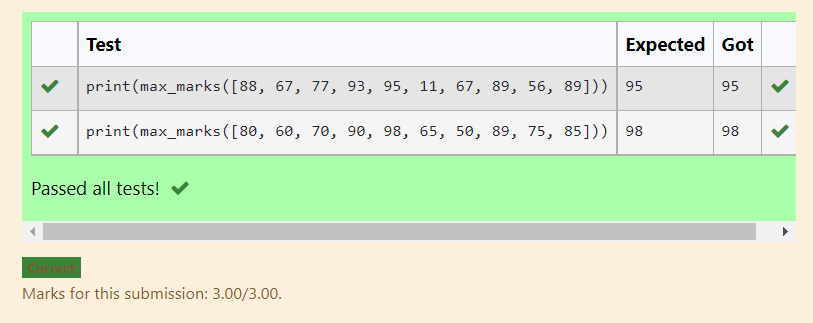
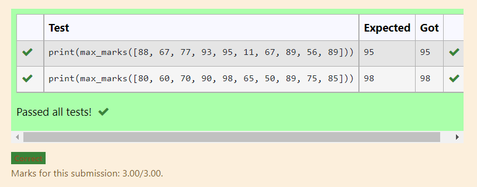
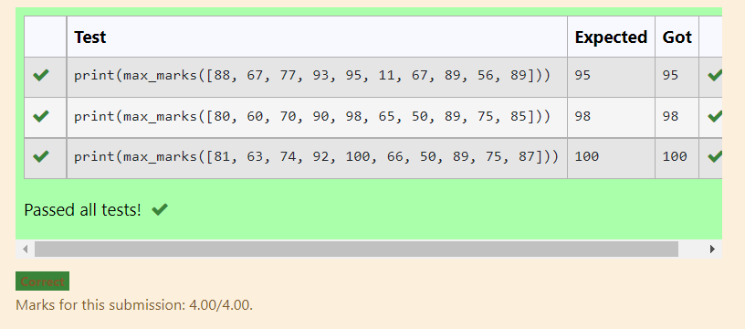

# Find the maximum of a list of numbers
## Aim:
To write a program to find the maximum of a list of numbers.
## Equipment’s required:
1.	Hardware – PCs
2.	Anaconda – Python 3.7 Installation / Moodle-Code Runner
## Algorithm:
1.	Get the list of marks as input
2.	Use the sort() function or max() function or use the for loop to find the maximum mark.
3.	Return the maximum value
## Program:

i)	# To find the maximum of marks using the list method sort.
~~~Python
''' 
Program to mark the maximum of marks using the list method sort
Developed by: kiran j
RegisterNumber: 21500363
'''
def max_marks(marks):
    #Write your code here
    marks.sort()
    large=marks[-1]
    return large

~~~

ii)	# To find the maximum marks using the list method max().
~~~Python
''' 
Program to find the maximum marks using the list method max().
Developed by: kiran
RegisterNumber: 21500363
'''
def max_marks(marks):
    # write your code9 here

    a=max(marks)
    return a

~~~

iii) # To find the maximum marks without using builtin functions.
~~~Python
''' 
Program to the maximum marks without using builtin functions.
Developed by: your name
RegisterNumber: 
'''
def max_marks(list1):
    # write your code here

    max_mark=0
    for i in list1:
        if i>max_mark:
            max_mark=i
    return max_mark

~~~
 
## Output:

 

## Result:
Thus the program to find the maximum of given numbers from the list is written and verified using python programming.